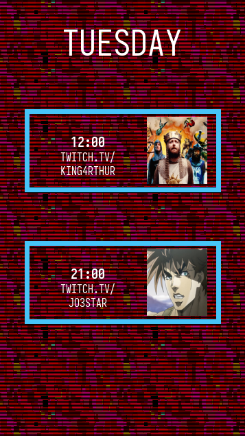

schedgen
========


[](https://codecov.io/gh/tarcisioe/schedgen)

This is a schedule image generator for streamer teams!

How to use
----------

First of all, create a style file in TOML.

Example:

```toml
[schedgen.style]
weekday_font = { file = "Hack-Bold.ttf", size = 50 }
schedule_height = 458
schedule_y = 87  # from the top

[schedgen.entry_style]
stroke_width = 7
max_height = 123
min_spacing = 7
width = 285
stroke_color = { r=238, g=17, b=75 }
url_font = { file="Hack-Regular.ttf", size=16 }
time_font = { file="Hack-Bold.ttf", size=20 }
url_position = { x=-50, y=0 }  # based off of the center of the rectangle
time_position = { x=-50, y=-20 }  # based off of the center of the rectangle
avatar_x = 80  # based off of the center of the rectangle

[schedgen.streamers]
'vinnydays' = { avatar='./vinnydays.png', service='twitch.tv' }
'ponzuzuju' = { avatar='./ponzuzuju.png', service='twitch.tv' }
'gamerdeesquerda' = { avatar='./gamerdeesquerda.png', service='twitch.tv' }
'0froggy' = { avatar='./0froggy.png', service='twitch.tv' }
'historiapublica' = { avatar='./historiapublica.png', service='twitch.tv' }
```

Then, run `schedgen` such as the following example:


```
$ schedgen --background background.png --output monday.png monday "historiapublica;12:00" "0froggy;21:00"
```

and the result will be as follows.


